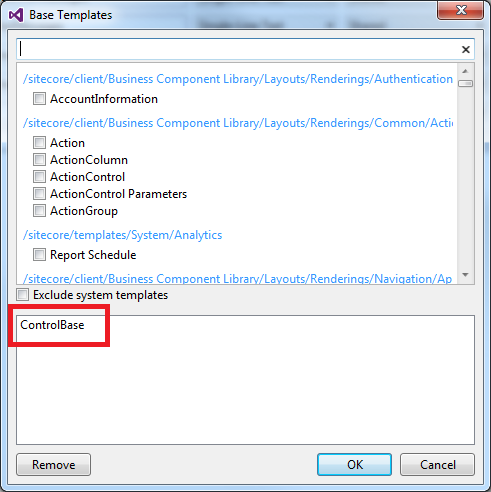
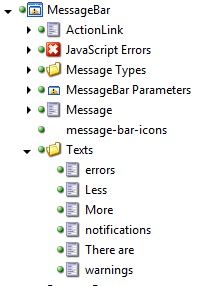

#SPEAK Component Guidelines

A SPEAK component is generally composed by a Razor File (.cshtml), a JavaScript file and a bunch of CSS.

### !important! Never use a component from another Sitecore Business Application.

##Components Structure.

When you create components for your Business Application or an entire component library, you should always use the same structure as the BCL structure.

Do not forget, if you create a business application, this structure needs to be placed under the **Common** folder.

**Please follow to the [component structure guideline](componentStructure.md) for more information** 

##Naming

A component name is **PascalCase**.

All the files related to a component **must** have the same name and same case.

- NameOfComponent.cshtml
- NameOfComponent.js
- NameOfComponent.(less|css)

All Items related to the component containing the Name should also be PascalCase.

If the component is brand new and has no relation with an existing one, please try to give it a meaningful name.

If the component is an extension of an existing component in the BCL, you should name **[app_name]NameOfTheComponent**

##Items

The component is a "View Rendering" item.

###Parameters Template

The component parameters template is a Template item. It must derived from the ControlBase (or another base control depending on the need).



- it must be called **NameOfComponent Paramters**
- do not forget to create __StandardValues and set default parameters there.
- it must be located **as a direct child of the ViewRendering Item**
- do not forget to set it on the View Rendering (Parameters Template).

###Items related to component

If you need Items or Template for you component. It is better to keep them **under the Component Item**. This makes the component **self-contained**. Meaning, the developer using your component does not need to go through the content tree in order to find the appropriate template to use.

There is currently no guideline defined on how to structure it under the Component.

If the item/templates you need are shared between different components, you need to move it under the system folder.

e.g:



##Coding Style

BCL is based on bootstrap. Therefore, we have adopted their code style guide for HTML and CSS.

####Razor

**Never put HTML in C#, HTML must be in cshtml file and not inside C#**. Having HTML in C# makes the maintenance and the styling of your component a nightmare for everyone.

*NOTE: As you can see, we did that mistake in previous version of SPEAK. When we needed to upgrade the style or change css class names for a component, this became a painful and bug prone task. This is why we have decided to only put HTML in razor file even if we know that razor inheritance is not working as expected*

NOTE: In SPEAK 1.2 using the technology preview layout, you can strongly type the View with a Model. The C# logic needed should be contained inside that object.

####HTML

Please refer to our [Html guidelines](html.md)

###CSS

Please follow [https://github.com/mdo/code-guide](https://github.com/mdo/code-guide)

####Additional Rule(s)

**Class naming conventions**

Never reference ```js-``` prefixed class names from CSS files. ```js-``` are used exclusively from JS files.

Use the ```is-``` prefix for state rules that are shared between CSS and JS.

### C# 

For C# part, please refer to the Sitecore guidelines.