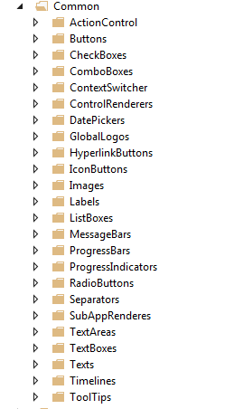

###SPEAK Component Structure.

When creating your component, under the Settings folder, you need to re-create the same structure as the BCL structure. Only create folders if you have component inside.

Use common sense to place your components in the different folder. Only create the folder if you need it.

**Authentications**

Components related to the Current User.

**Behavior [DEPRECATED]**

You should not use Behaviors as they will be deprecated in the next version of SPEAK.

**Common**

It contains simple component which does not have placeholder.

**Containers**

It contains simple component which has placeholder.

**Dialogs**

Components which would be only use for a dialog. Normally, you should not have components in that folder, if you have, please contact the SPEAK team.

**Forms**

Components related to a specific form. In the BCL, we have currently the Uploader and the Uploader Info. Those 2 components are in fact more or less stand-alone component as they require a controller in the server side.

e.g: a Contact Form could be located there.

**ListsAndGrids**

Components which generally takes an Array of Items or JSON object and renders it in the page.

e.g: ListControl, Treeview, Carousel,...

**Navigation**

Components which redirect component to another page or change the layout of the page.

**SearchingAndFiltering**

Components which are used for filtering data or which are related to a search in the page.

**Silverlight**

Components which needs Silverlight in order to run.

**Structure**

Components which only deals with the structure of a page. Just pure HTML (no javascript) and which defines the placeholders of your page.

This structure is divided in 2 parts:

- The Page Structures:

Components which defines the overall structure of the page.

You should normally do not need such a component as the BCL has already created page structure for your page (Dashboard, List, Task).

- The Substructures:

Components which defines only a specific part of a page.

e.g. let's say you have a Task page and inside a tab, you have a complex layout which would be really hard to re-create with border, rowPanel or columnPanel component. Here is the good place to create your substructure component.

###Visual Studio Structure

Until the categories, your project should follow the same file structure as the content-tree except from the folder where you place your .CSHTML and Javascript File.

The name of the folder should be **plurial** (see picture below).

**When you create a component, check if it can be considered as specialized version of your one of the BCL component** Maybe the BCL component is missing feature and you want to extend it by re-creating a new one.

In that case, you must place the component in the same folder name as the BCL **in your own component folders** and called it [app_name]NameOfTheComponent. 

e.g. Nerva has created a specialized ListControl because he was missing feature. Nerva team will place those files under /app_name/Common/Layouts/Renderings/ListControls and called the control "[app_name]ListControl".

In that way, SPEAK Team can quickly see if they need to extend the current listcontrol or make your component more global. In case of doubt, ask the SPEAK Team.

