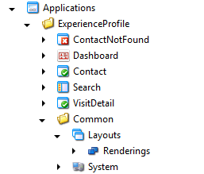
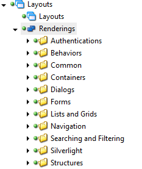
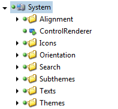

#SPEAK Coding Style

##Application Type

They are currently 3 types of SPEAK application.

- Business Application (eg. ECM, Experience Profile,...)
- Dialogs (eg. SelectMediaDialog, InsertLinkDialog,...)
- Custom

###Shared Rules

Some rules are shared between different application types.

1) Your pages **must** follow the Page guideline.

2) You **must** contact the SPEAK Team if you need a new kind of component.

###Business Application

A business application is an application created internally by Sitecore which uses mainly the BCL in order to increase the UI/UX consistency by following the UX guidelines.

When building a business application, try to make it self-contained. Do not spread your items accross different folders. This makes your application hard to maintain and decrease separation of concern by having people re-using your items or templates. 

Eg:

####Business Application Rules

1) Your application **must** be placed under /sitecore/client/Applications/

2) Create a Folder with the Name of your application and give it an **Icon**.

The **Icon** must be approved by UX team.

3) Create the Root page for your application

The root page of your application **must be a Dashboard page called Dashboard** which uses the **Speak-DashboardPage as Template**.

This page is the **ROOT** of your application

4) Make the application appears in the Launchpad

Create a Speak-AppShortcut item under /sitecore/client/applications/Launch Pad/Page Settings/Shortcurts

Each shortcut must have an **Icon** (must be the same as your app folder) and a **Title**

Icon and Title **must** be approved by Mgmt.

5) Create a Settings Folder

That folder should contain all your Templates/Layouts/Renderings/Items needed to your application.

For your component, try to replicate the same structure as the BCL. This makes things easier if your component is upgraded to the BCL.

6) **NEVER** create your own layout

Creating your own layout should be avoided at any cost. Ideally, all your pages should use the "speak-layout".

In case of really specific needs, please contact KB, JC or PDE.

7) System Folder should be created under the Settings Folder.

System will contain all the items needed by your application and shared among your pages. Those are generally Text item for translation, share configurations,...

8) Templates Folder should be created under the Settings Folder

If you need specific templates for your application, you must place them under the System Folder. As those templates are really specific to you application, you are free to choose the structure you want.

9) **An application should never rely on components placed outside BCL**

You should only use your own component or the component placed under BCL. Never, at any case, re-use a component of another application.

If you need the exact-same component for your application, please ask the SPEAK Team to integrate that component in the BCL.

10) Do you need public templates/items?

It is important that you contact the SPEAK Team. If you create items that you want to be re-used by other application, it is important to communicate this to the SPEAK Team. They will make sure you place it in the right place in your content tree.

###Dialogs (global)

A Dialog is generally a SPEAK Page opened by the Content Editor in a dialog box.

E.g: SelectMediaDialog, InsertItemLink.

####Dialog Rules

1) Your dialog **must** be placed under /sitecore/client/Applications/Dialogs

2) **NEVER** create your own layout for a Dialog

Creating your own layout should be avoided at any cost. Ideally, all your dialogs should use the "speak-layout".

3) A dialog page item must use the Speak-DialogPage template.

###Custom

To be defined.